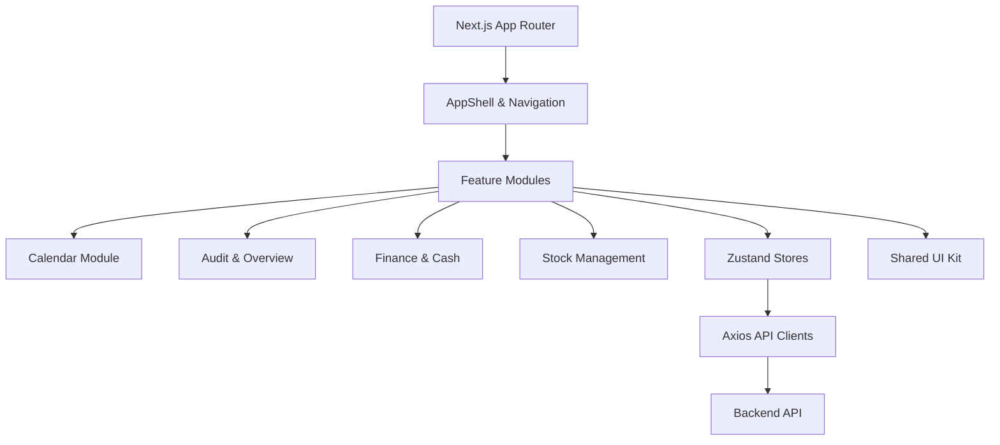

# 🏛 Adelante CRM - Master Documentation (v1.0)

Це вичерпний посібник з архітектури, бізнес-логіки та технічної реалізації Adelante CRM.

---

## 1. 📂 Архітектурна карта (High-Level)

Система побудована за принципом **Feature-Driven Development**. Кожен бізнес-модуль повністю автономний.

---

## 2. 🧩 Функціональні модулі (Features)

### 📅 **Календар (Calendar)**
- **Логіка**: Планування записів у реальному часі.
- **Ключові компоненти**: `CalendarGrid`, `AppointmentCard`, `CreateAppointmentModal`.
- **Особливості**: Розрахунок конфліктів у розкладі, підтримка "запису для іншої особи".

### 🔍 **Огляд та Аудит (Overview)**
- **Логіка**: Контроль якості та безпека даних.
- **Ключові компоненти**: `RecordDetailsModal` (4 таби: Деталі, Фінанси, Аудит, Медіа).
- **Особливості**: Drag & Drop завантаження фото, повна історія змін (`history`).

### 💰 **Фінанси (Finances)**
- **Логіка**: Керування касовими операціями, чеками та методами оплати.
- **Ключові компоненти**: `ReceiptsView`, `OperationsList`, `CashRegisterCard`.

### 📦 **Склад (Inventory)**
- **Логіка**: Контроль залишків, рух товарів та списання.
- **Ключові компоненти**: `ProductTable`, `StockMovementModal`.

---

## 🏗 3. Дизайн-система (Shared UI)

Ми використовуємо кастомну UI-систему на базі **Vanilla CSS Variables**.

| Компонент | Призначення | Особливості |
| :--- | :--- | :--- |
| `Modal` | Основа всіх вікон | Анімований, адаптивний, підтримка `xl/lg/md` |
| `Dropdown` | Контекстні меню | Повна підтримка клавіатури, портали |
| `Badge` | Статуси | Динамічні кольори (`success`, `danger`, `warning`) |
| `DatePicker` | Вибір дати | Кастомний календар з підтримкою періодів |

---

## 📡 4. Повна API Специфікація (50+ Ендпоінтів)

### **Auth (`/auth`)**
- `POST /login`, `POST /refresh`, `GET /me`, `POST /logout`

### **Appointments (`/appointments`)**
- `GET /`, `GET /:id`, `POST /`, `PATCH /:id`, `DELETE /:id`
- `PATCH /:id/status` — зміна статусу (Confirmed, Completed)

### **Clients (`/clients`)**
- `GET /`, `POST /`, `PUT /:id`, `GET /:id/history`
- `POST /import` — імпорт з Excel

### **Finances (`/finances`)**
- `GET /operations`, `POST /operations`
- `GET /receipts`, `GET /cash-registers`
- `GET /dashboard` — фінансова аналітика

### **Inventory (`/inventory`)**
- `GET /products`, `POST /stock-movement`

---

## 🧠 5. Державне управління (Zustand Stores)

- **`useAuthStore`**: Токени, профіль, права доступу.
- **`useCalendarStore`**: Тимчасові записи, фільтри календаря.
- **`useUIStore`**: Стан сайдбару, глобальний лоадер, темна тема.
- **`useNotificationsStore`**: Real-time сповіщення через WebSocket.

---

## 🚀 6. Roadmap до Продакшену

### Крок 1: Підключення Реального Backend
- Змінити `NEXT_PUBLIC_USE_MOCK_DATA=false` у `.env`.
- Налаштувати S3 або інше сховище для фото в `RecordDetailsModal`.

### Крок 2: Безпека
- Реалізувати Refresh Token logic у `src/lib/api/client.ts`.
- Додати валідацію ролей на кожному етапі API.

### Крок 3: Оптимізація
- Впровадити `React.lazy` для важких модулів (Reports, Finances).
- Налаштувати PWA для роботи адміністраторів з планшетів.

---
*Документація згенерована автоматично системою Antigravity AI*
*Дата останнього аудиту: 14 травня 2026 року*
